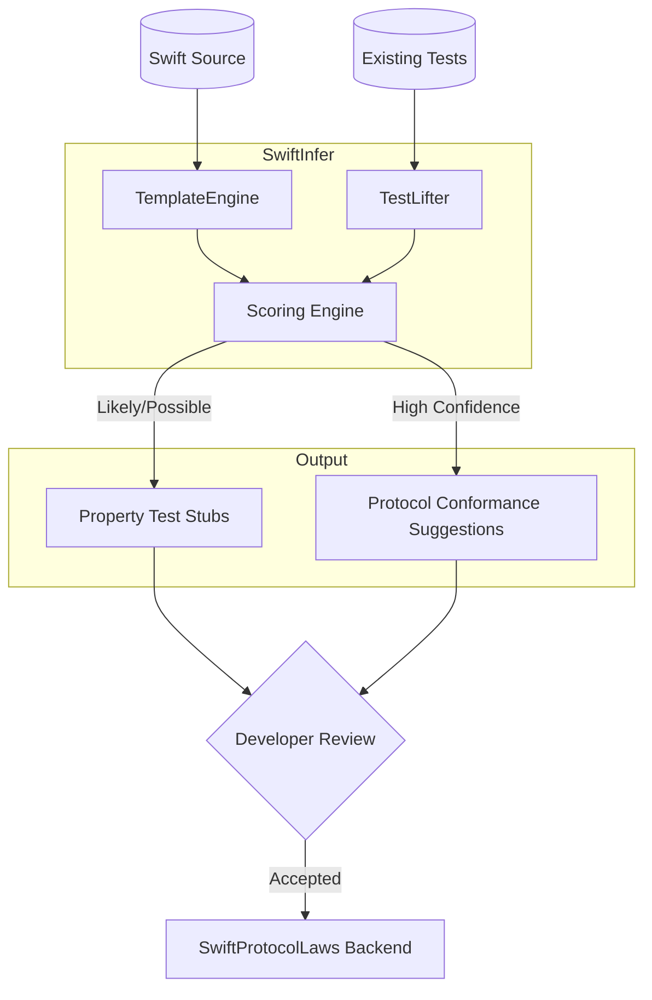

This is a sophisticated PRD. You've correctly identified a massive gap in the Swift ecosystem: the "activation energy" required to move from specific unit tests to generalized property-based testing. While **SwiftProtocolLaws** handles the formal contracts, **SwiftInfer** acts as the "semantic detective," finding patterns the developer likely intended but didn't formalize.
Below is a critique of the current proposal and an expansion into technical and UX areas that will determine the project's real-world adoption.
## 1. Critique of the Current Proposal
### The "Naming Heuristic" Fragility
Your **TemplateEngine** relies heavily on naming conventions (e.g., normalize, compress). In legacy codebases or those with non-English naming, this signal weakens significantly.
 * **Risk:** If the naming signal is weak, the tool might fall back to "Low Confidence" too often, leading to "suggestion fatigue."
 * **Recommendation:** Supplement naming heuristics with **Type-Flow Analysis**. If a function takes T and returns T, and is called twice in a row in a unit test, that is a stronger signal for idempotence than the name format().
### The "TestLifter" Noise Problem
Unit tests are often "messy." They include setup code, mocks, and unrelated assertions.
 * **Critique:** Section 6.2 assumes a very clean "Assert-after-Transform" structure. In reality, testRoundTrip might involve five lines of JSONDecoder configuration that aren't part of the property itself.
 * **Recommendation:** TestLifter needs a "Slicing" phase to isolate the values being asserted from the boilerplate required to create them.
### Interaction with SwiftProtocolLaws
You mention that SwiftInfer is "downstream". However, there is a missed opportunity for a **Feedback Loop**.
 * **Critique:** If SwiftInfer finds a Strong-confidence Monoid (identity + associativity), it should not just suggest a test; it should suggest a **refactor** to actually conform to a protocol that *SwiftProtocolLaws* can then verify forever.
## 2. Expanded Technical Requirements
### A. The "Heuristic Scoring" Engine
Instead of binary confidence tiers, implement a weighted scoring system for the **Confidence Model**.
| Signal Type | Weight | Description |
|---|---|---|
| **Exact Name Match** | +40 | Function matches a known inverse (e.g., encrypt/decrypt). |
| **Type Signature** | +30 | T \rightarrow U and U \rightarrow T symmetry exists in the same scope. |
| **Test Body Pattern** | +50 | TestLifter identifies the pattern in 3+ distinct tests. |
| **Complexity Penalty** | -20 | Function has side effects (detected via @discardableResult or lack of pure markers). |
### B. The "Refinement CLI" UX
A static text dump of stubs is helpful, but an **Interactive CLI** would be better.
 * **Requirement:** The CLI should allow a "Triage Mode."
   * *SwiftInfer:* "I found a potential round-trip between zip() and unzip(). Is this correct? (y/n)"
   * *Developer:* "y"
   * *SwiftInfer:* "Great. I've generated the property test and placed it in UnzipTests.swift. I also found you don't have a generator for ArchiveFolder. Should I stub a .todo generator? (y/n)".
## 3. Expansion: Proposed New Features
### 1. Property-Driven Refactoring (The "Bridge")
If **TemplateEngine** identifies a high-confidence algebraic property, SwiftInfer should suggest adding the corresponding protocol conformance.
 * **Example:** If merge(a, b) is Commutative and Associative, and an identity element is found, SwiftInfer suggests:
   > "This pattern matches a **Monoid**. Consider conforming to AdditiveArithmetic or a custom Monoid protocol to enable SwiftProtocolLaws verification.".
   > 
### 2. "Property Drift" Detection (CI Integration)
Add a "Drift" mode for CI pipelines.
 * **Requirement:** If a developer adds a new function that matches a template (e.g., decompressV2) but doesn't add a corresponding property test, the CI emits a **Warning** (not a failure).
 * **Value:** This ensures that as the codebase grows, the "Property Coverage" doesn't dilute.
### 3. Smart Generator Synthesis
Expand section 6.4 (Generator Inference) to include **Mock-based Generation**.
 * **Requirement:** If a type is too complex for Gen.derived, TestLifter should look at how the type was constructed in existing unit tests.
 * **Logic:** If 10 tests create User using User(id: Int, name: String), TestLifter should suggest:
   ```swift
   static var gen: Gen<User> {
       Gen.zip(Gen.int, Gen.string).map(User.init)
   }
   
   ```
## 4. Updated Architecture Diagram
This adds the "Refinement" and "Refactor" loops to your existing architecture.

## 5. Strategic Open Question: "The Generator Gap"
The biggest friction point in property testing is writing the **Generators**. Even with .todo stubs, many developers will bail if the generator is hard to write.
 * **Expansion Idea:** Should SwiftInfer include a **Macro-based Generator**?
   * @GenerateProperties(for: MyType.self)
   * This would use the same logic as TestLifter to automatically synthesize a Gen<T> based on memberwise initializers, significantly reducing the "Activation Energy".
Does this align with your vision of keeping the developer "in the loop," or does it lean too far into automation?
